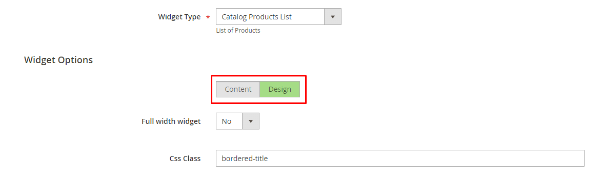

# SR_Widgets

## Implemented widgets:

### Banners, Banner, Catalog Products List (shared options)
Widgets can have custom:
* css class for styles customization
* text color
* background color 
* background gradient
* background image
* indents (vertical margin/padding for desktop/mobile)
* Widgets can be full width (only on home page)

### Banners

Examples [1](docs/examples/banners/1.png),
         [2](docs/examples/banners/2.png),
         [3](docs/examples/banners/3.png),
         [4](docs/examples/banners/4.png),
         [5](docs/examples/banners/5.png),
         [6](docs/examples/banners/6.png),
         [7](docs/examples/banners/7.png),
         [8](docs/examples/banners/8.png)

* Implements up to 6 banners + 1 primary banner
* Banners columns can be managed by "Grid Classes" parameter   
_(Grid classes naming similar to bootstrap)_
* Banners can become a slider (**not implemented yet**)
* Each banner can have 
  * Title
  * Link label
  * Link URL
  * Image

### Banner

Examples [1](docs/examples/banner/1.png),
         [2](docs/examples/banner/2.png),
         [3](docs/examples/banner/3.png),
         [4](docs/examples/banner/4.png),
         [5](docs/examples/banner/5.png),
         [6](docs/examples/banner/6.png),
         [7](docs/examples/banner/7.png),
         [8](docs/examples/banner/8.png),
         [9](docs/examples/banner/9.png),
         [10](docs/examples/banner/10.png)

* Implements single banner with: 
  * image (for desktop)
  * image (for mobile)
  * title
  * description 
  * up to 4 links

### Catalog Products List

* Based on native magento 2 "Catalog Products List" widget

[//]: # (### Homepage Video)

[//]: # (### Quick Navigation)

[//]: # (### Info Blocks)

## Tabs switcher

Widgets parameters can be separated into content/design tabs.
To add widget parameter to specific tab add following code to parameter description:   
`<![CDATA[<hidden data-section-scope="<design/content>"/>]]>`
